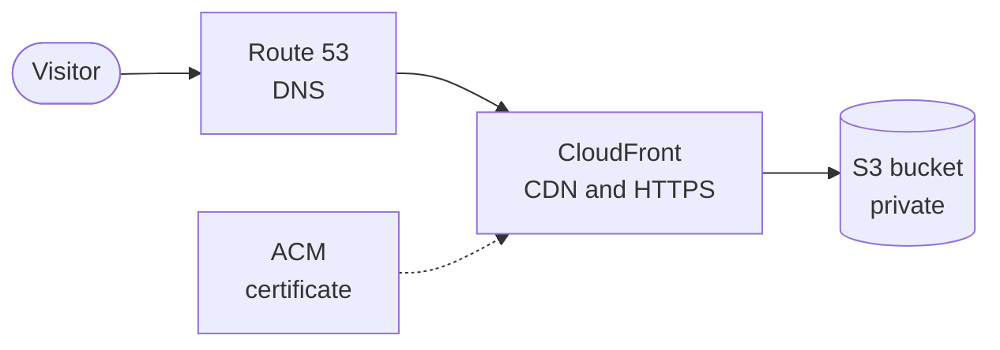

# Rudra Travels website: AWS hosting notes

Live site: https://rudra-travels.com

This repo is my notes on how that website is hosted on AWS, plus a Terraform template based on the
setup. The website's own code and photos are not in here. They belong to the business, which is a
family member's trekking company in Kathmandu.

Short on time? The part worth reading is Problem 3 (the lost Terraform state) in
[docs/concepts-and-problems.md](docs/concepts-and-problems.md).

## Architecture

## How it was built

I used Claude, an AI assistant, to guide and debug this build and to learn as I went. I ran every
command myself. The guides in `docs/` were written with Claude's help. There's a list at the end of
what I'm still working through.

## How the hosting works

- The site is plain HTML, CSS and JavaScript. There is no server code, no database and no Lambda.
- The files sit in a private S3 bucket in the London region.
- CloudFront, AWS's content delivery network, sits in front of the bucket and serves the site over
  HTTPS. The certificate comes from AWS Certificate Manager.
- Route 53 handles DNS. The domain is registered at names.co.uk, and its nameservers point to Route 53.
- Terraform was used to create all of this.
- The first version also had an EC2 server and a Lightsail WordPress site. Both were removed. On
  6 October 2026 I checked, and no instances remain in the London region.

## Deploying

By hand for now. A script uploads the files with `aws s3 sync`, then clears CloudFront's cache so
visitors get the new version.

## Problems along the way

- **DNS errors that weren't errors.** After changing nameservers, `dig` returned SERVFAIL for a
  while. DNS was still spreading across the internet.
- **"Bucket already exists" after a rebuild.** Fixed by importing the existing bucket into Terraform.
- **Lost Terraform state.** While swapping folders I deleted the one holding `terraform.tfstate`, the
  file Terraform uses to remember what it built. `terraform plan` then wanted to create 14 resources
  that already existed, so I did not apply it. Terraform no longer tracks the live setup, which is
  why the Terraform in this repo is a template and not the live code. More in
  [docs/concepts-and-problems.md](docs/concepts-and-problems.md).
- **Old pages after a deploy.** My browser kept showing the old site. The server was serving the
  new one, and I confirmed that with `curl`.

## Still to do

- Rebuild Terraform's state by importing the live resources, and store it in S3 so it can't be lost
  by deleting a folder.
- Automate deploys. Not started.
- Cache headers. The HTML, JS and CSS files currently have no `cache-control` header, so browsers
  can hold on to old copies. The fix is an updated deploy script that I haven't run yet.

## What I'm still learning

I can't yet explain these without notes:

- why CloudFront sits in front of S3
- what delegating DNS to Route 53 means
- what Terraform state is, and why losing it mattered
- what a CloudFront cache invalidation does

I'm working through them one at a time.

## What's in this repo

- `docs/`: three guides (concepts and problems, a command-by-command timeline, and how to redo it
  on a new domain), as Markdown, with Word copies in `docs/word-versions/`.
- `terraform/`: a template for a **new** domain. Don't run it against `rudra-travels.com`. See the
  warning at the top of `terraform/README.md`.
